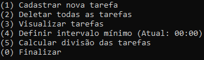
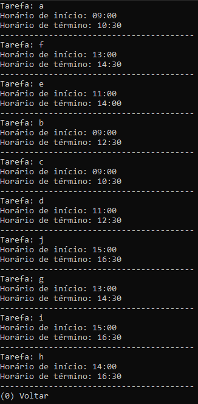
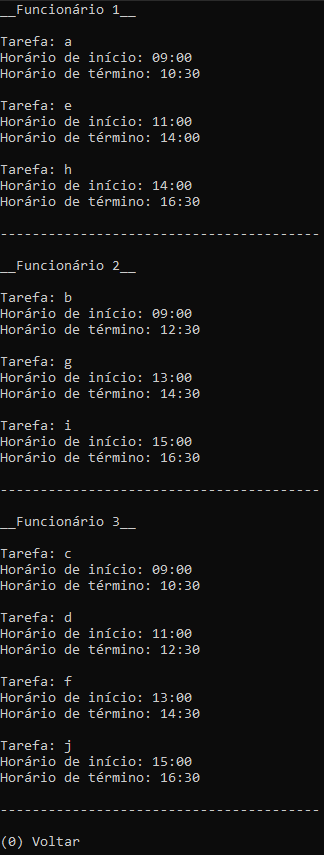

# Manutenção

**Número da Lista**: 3<br>
**Conteúdo da Disciplina**: Greed<br>

## Alunos
|Matrícula | Aluno |
| -- | -- |
| 18/0114077  | Lucas Rodrigues Fonseca |
| 18/0113861  | Kleidson Alves Corrêa |

## Sobre 
Uma empresa que realiza manutenções precisa de ajuda para distribuir as tarefas que devem ser realizadas por seus funcionários. Ela deseja distribuir as tarefas de forma que utilize o menor número possível de funcionários para realizar as tarefas do dia e que ao mesmo tempo elas sejam o melhor distribuídas possível dentre esses trabalhadores. Deve existir também um intervalo mínimo, que indica um período de tempo mínimo que deve ser respeitado entre o término de uma tarefa e o início de outra realizadas por um mesmo funcionário. Isso pode ser entendido, por exemplo, como um tempo médio que leva para o funcionário se preparar para a próxima tarefa. Dessa forma, um intervalo maior pode fazer com que sejam necessários mais funcionários para realizar as mesmas tarefas.

## Screenshots
| Menu principal | Visualização das tarefas | Disivão das tarefas |
| :-: | :-: | :-: |
|  |  |  |

## Instalação 
**Linguagem**: C++<br>

### Como instalar as dependências
```
sudo apt install git
sudo apt install make
sudo apt install g++
```

### Como executar
```
git clone https://github.com/projeto-de-algoritmos/Greed_Manutencao
cd Greed_Manutencao
make
make run
```

## Uso 
- **Cadastrar nova tarefa:** Insira a descrição, o horário de início e o horário de término para cadastrar uma nova tarefa.
- **Deletar todas as tarefas:** Deleta todas as tarefas cadastradas anteriormente. É necessário confirmar a operação.
- **Visualizar as tarefas:** Mostra todas as tarefas cadastradas anteriormente em ordem de cadastro.
- **Definir intervalo mínimo:** É necessário inserir a quantidade de horas e minutos para definir o intervalo mínimo. Para utilizar sem intervalo deixe em 00:00.
- **Calcular divisão das tarefas:** Roda o algoritmo de interval partitioning para determinar a melhor maneira de dividir as tarefas respeitando o intervalo mínimo definido no momento.

## Outros 
O vídeo de explicação do programa está na pasta raíz do repositório.
